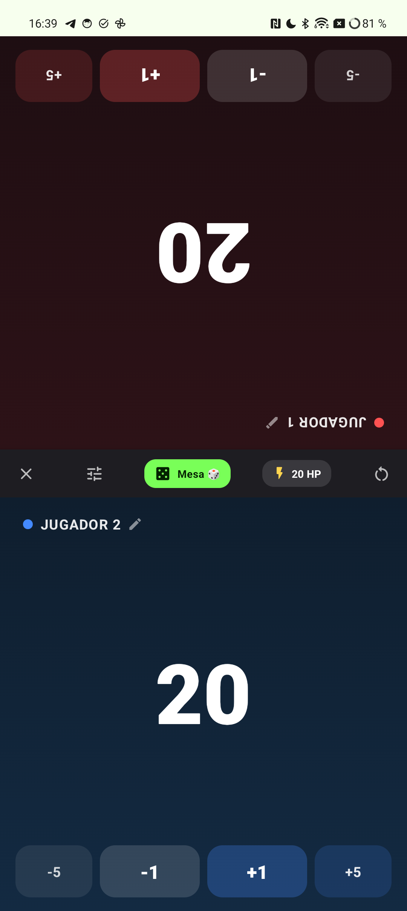
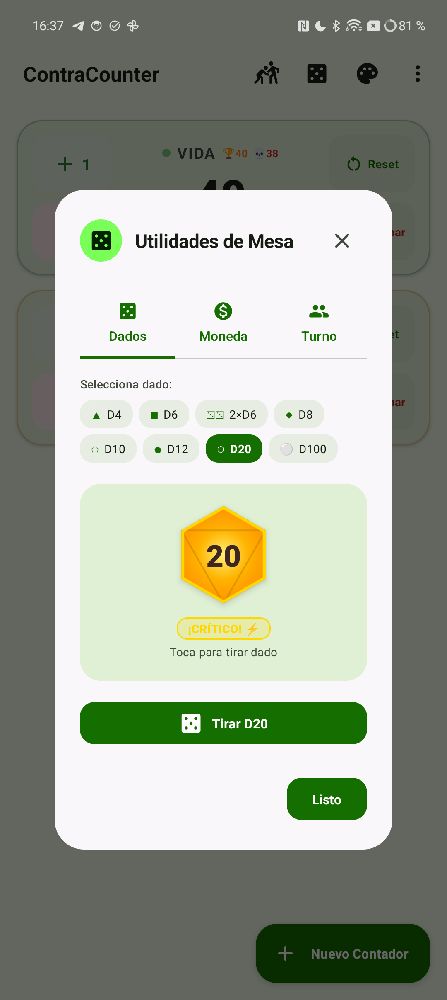
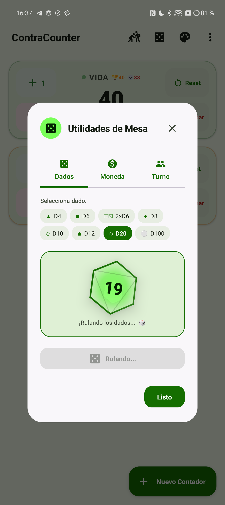
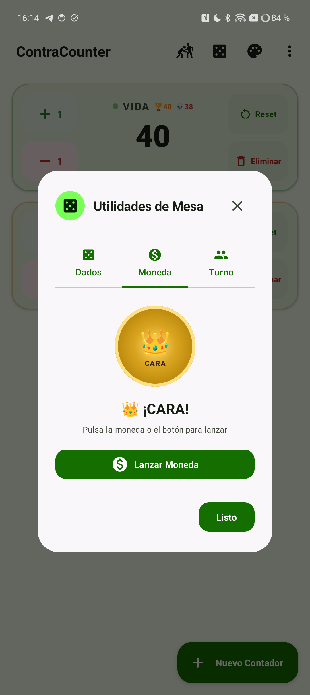
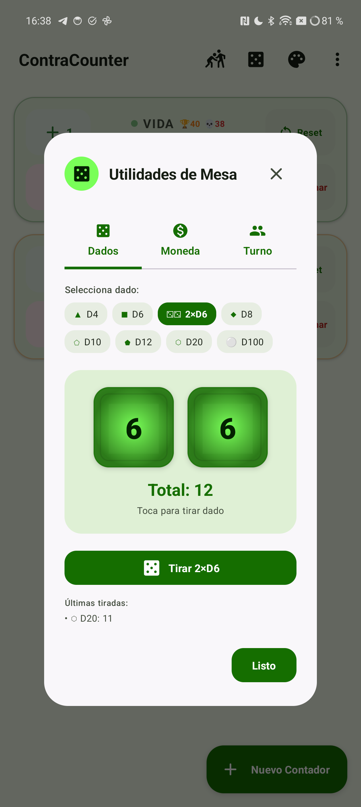

# ContraCounter 🔢⚔️🎲⚡

> Aplicación de contadores, utilidades de mesa y partidas cara a cara para Android, diseñada con **Jetpack Compose + Material Design 3 (Material You)** nativo. Pensada desde cero para ser ultra reactiva, ergonómica y visualmente impecable en dispositivos **Google Pixel** y Android moderno.

---

## 🚀 ¿Por qué ContraCounter?

La mayoría de aplicaciones de contadores presentan interfaces anticuadas, carecen de retroalimentación inmediata y no están pensadas para situaciones reales de juego de mesa o TCG (Magic: The Gathering, Yu-Gi-Oh!, Pokémon, Lorcana, Star Wars Unlimited, wargames o deportes).

**ContraCounter v2.0.0** evoluciona la experiencia a un nuevo nivel:

### ⚔️ 1. Modo Duelo Cara a Cara (2 Jugadores en Mesa)
- **Orientación Dividida 180°:** El Jugador 1 se orienta a 180° hacia el rival enfrente de la mesa mientras el Jugador 2 se mantiene a 0°. El padding está milimétricamente ajustado para que la cámara frontal y el notch no obstaculicen ningún botón.
- **Puntuación Colosal & Botones Rápidos:** Cifras gigantes con botones táctiles `-5`, `-1`, `+1`, `+5` y Shadow Delta flotante sincronizado.
- **Sub-contadores de Veneno / Comandante:** Contadores secundarios con límite letal en 10 contadores.
- **Presets de Vida Instantáneos:** Cambia entre 20 HP (MTG Estándar), 30 HP (Commander 1v1 / SW Unlimited), 40 HP (Commander clásico), 8000 LP (Yu-Gi-Oh!), 6 Premios (Pokémon) o introduce vidas personalizadas.
- **Detección de K.O & Revancha:** Alerta visual y háptica cuando una vida llega a 0 o el veneno a 10 con reinicio al vuelo.

### 🎲 2. Utilidades de Mesa Auxiliares (Tabletop Tools)
- **Dados Polihédricos con Geometría Real:**
  - Siluetas polihédricas proyectadas según el tipo: **▲ D4 (Tetraedro)**, **■ D6 (Cubo)**, **⚂⚂ 2×D6 (Doble Cubo con suma)**, **◆ D8 (Octaedro)**, **⬠ D10 (Trapezoedro)**, **⬟ D12 (Dodecaedro)**, **⬡ D20 (Icosaedro)** y **⚪ D100 (Orbe porcentual)**.
  - Líneas de facetas interiores 3D grabadas en cada dado.
- **Animación Material 3 Expressive Motion:**
  - Elevación dinámica de mesa (`4dp` a `16dp`) con sombra proyectada envolvente.
  - Volteo y traqueteo 3D en los ejes X, Y y Z (`rotationX`, `rotationY`, `rotationZ` + `shake`).
  - Curva de deceleración orgánica tipo física real (13 frames) con vibración táctil rítmica.
  - Choque e impacto elástico al aterrizar con `Spring` physics y destello luminoso.
  - Badges de tiradas épicas: **¡CRÍTICO! ⚡** (20 en D20), **¡PIFIA! 💀** (1 en D20), **¡100 PERFECTO! 👑** y **¡MÁXIMO! 🔥**.
- **Lanzador de Moneda en 3D:** Volteo metálico de 1440° con aterrizaje limpio en Cara 👑 o Cruz ⚔️ y contador de estadísticas de sesión.
- **Sorteo de Primer Turno:** Ruleta rápida y aleatoria para decidir quién empieza la partida.

### 📜 3. Historial Cronológico y Anotaciones
- **Actividad de Historial Dedicada (`HistoryActivity`):** Registro cronológico agrupado por días con desglose exacto de hora, minuto y segundo de cada operación (`+X` / `-X`).
- **Anotaciones In-App:** Añade notas y apuntes de partida directamente desde el modo pantalla completa.
- **Exportación de Datos:** Comparte y exporta todo tu historial en formato texto o JSON estructurado.

### 🏆 4. Metas Límite y Alertas de Victoria / K.O
- Fija objetivos de puntos (Target) y umbrales mínimos de derrota (K.O) en cualquier contador con alertas automáticas y vibraciones diferenciadas.

### 📳 5. Ajustes de Vibración Háptica
- Menú de ajustes Material 3 para activar o desactivar la respuesta háptica táctil en toda la aplicación.

### 📱 6. Widget de Escritorio (AppWidget)
- Controla y visualiza tus contadores directamente desde la pantalla de inicio de tu Android con acciones rápidas de suma, resta y ciclado.

### 🎨 7. Selector de Temas Visuales (Modal M3)
- **Material 3 (Pixel):** Dynamic Colors de Monet vinculados al fondo de pantalla de tu dispositivo.
- **Modo Poke 💕:** Estilo *fancy chic* con tonos rosita pastel, blush y rose gold.
- **Cyberpunk ⚡:** Night City vibes con tonos neón cian y acentos amarillo eléctrico.
- **Matcha Esmeralda 🌿:** Tonos botánicos y salvia ultra relajantes.

### 📺 8. Modo Pantalla Completa Inmersivo Hero
- Toca cualquier contador para abrir su pantalla completa dedicada con cifras gigantes (hasta 104sp), botones Hero ergonómicos, selector de Keep Screen On y transición nativa compatible con Predictive Back de Android 14/15.

---

## 📸 Capturas de Pantalla

| Modo Duelo Cara a Cara ⚔️ | Dados Polihédricos D20 🎲 | Dados Rulando en 3D 🌀 | Lanzador de Moneda 3D 🪙 | Doble Cubo 2xD6 ⚂⚂ |
| :---: | :---: | :---: | :---: | :---: |
|  |  |  |  |  |

| Vista Principal (Modo Poke 💕) | Pantalla Completa Hero | Shadow Delta Tracker (+3) | Ajuste Rápido Modal | Selector de Temas M3 |
| :---: | :---: | :---: | :---: | :---: |
|  |  |  |  |  |

---

## 🛠️ Tecnologías y Arquitectura

- **Lenguaje:** Kotlin 1.9+
- **UI Framework:** Jetpack Compose (BOM 2023.10.01 / Material Design 3)
- **Motion System:** Compose Expressive Animations (`Animatable`, `spring`, `graphicsLayer`, 3D camera distance)
- **Geometry Engine:** Proyecciones polyédricas personalizadas con `GenericShape`, `Path` y renderizado de facetas en `Canvas`
- **Gestión de Estado:** Android ViewModel + Kotlin Coroutines + `StateFlow`
- **Persistencia:** SharedPreferences + Gson
- **Widgets:** Android AppWidgetProvider nativo con layouts remotos
- **Target SDK:** Android 34 (soporta desde Android 8.0 Oreo - API 26 hasta Android 15/16)

---

## 📁 Estructura del Código

```text
ContraCounter/
├── app/
│   ├── src/main/
│   │   ├── AndroidManifest.xml
│   │   ├── java/dev/contratop/contracounter/
│   │   │   ├── MainActivity.kt
│   │   │   ├── FullscreenCounterActivity.kt
│   │   │   ├── DuelActivity.kt
│   │   │   ├── HistoryActivity.kt
│   │   │   ├── data/
│   │   │   │   ├── Counter.kt
│   │   │   │   └── CounterRepository.kt
│   │   │   ├── widget/
│   │   │   │   └── ContraCounterWidget.kt
│   │   │   └── ui/
│   │   │       ├── ContraCounterApp.kt
│   │   │       ├── CounterViewModel.kt
│   │   │       ├── FullscreenCounterScreen.kt
│   │   │       ├── DuelScreen.kt
│   │   │       ├── HistoryScreen.kt
│   │   │       ├── theme/
│   │   │       │   ├── Color.kt
│   │   │       │   ├── Theme.kt
│   │   │       │   └── Type.kt
│   │   │       └── components/
│   │   │           ├── CounterCard.kt
│   │   │           ├── ShadowDeltaBadge.kt
│   │   │           ├── TabletopToolsDialog.kt
│   │   │           ├── SetLimitsDialog.kt
│   │   │           ├── SettingsDialog.kt
│   │   │           ├── AddCounterDialog.kt
│   │   │           ├── SetDirectValueDialog.kt
│   │   │           ├── ResetConfirmDialog.kt
│   │   │           ├── DeleteConfirmDialog.kt
│   │   │           ├── ThemeSelectorDialog.kt
│   │   │           ├── AboutDialog.kt
│   │   │           └── QuickAdjustModal.kt
│   │   └── res/
│   │       ├── layout/
│   │       │   └── widget_layout.xml
│   │       ├── drawable/
│   │       │   ├── app_icon.xml
│   │       │   └── contratop_logo.png
│   │       ├── xml/
│   │       │   ├── contra_counter_widget_info.xml
│   │       │   └── file_paths.xml
│   │       └── values/
├── build.gradle.kts
├── settings.gradle.kts
└── gradle.properties
```

---

## 📦 Compilación y Generación del APK

### 1. Compilar APK Debug (Para pruebas locales)
```bash
./gradlew assembleDebug
```
El APK generado se encuentra en:
`app/build/outputs/apk/debug/app-debug.apk`

### 2. Instalar por ADB en tu dispositivo
```bash
adb install -r app/build/outputs/apk/debug/app-debug.apk
```

### 3. Compilar APK Release
```bash
./gradlew assembleRelease
```
El APK firmado para distribución se genera en:
`app/build/outputs/apk/release/app-release.apk`

## 📲 Instalación y Actualizaciones

- **Descarga directa:** Puedes descargar el APK de producción desde la pestaña de [Releases de GitHub](https://github.com/contratop/ContraCounter/releases/latest).
- **Nota para usuarios de la v1.0.0:** Debido al cambio a una clave de firma criptográfica permanente y fija en el repositorio para evitar incompatibilidades en CI, si tenías instalada la versión `v1.0.0`, debes desinstalarla antes de instalar la `v2.0.0` (o verás el mensaje *"Aplicación no instalada"*). A partir de la `v2.0.0`, todas las futuras versiones se actualizarán limpiamente sin desinstalar.

---

## 👥 Desarrollado por
Desarrollado con ❤️ por **ContratopDev**.
