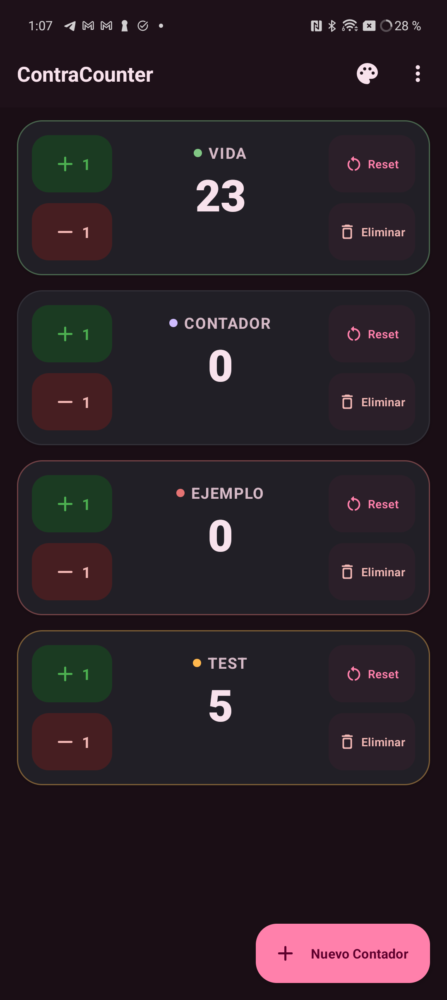
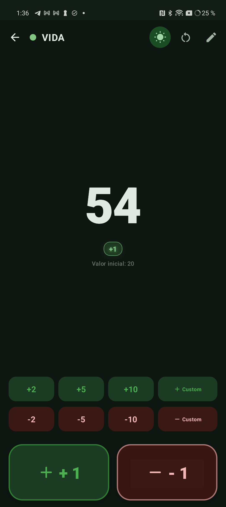
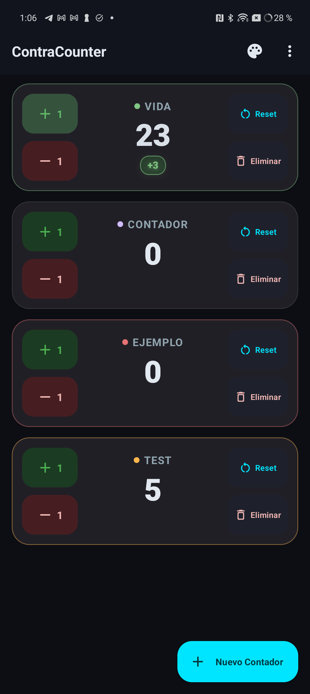
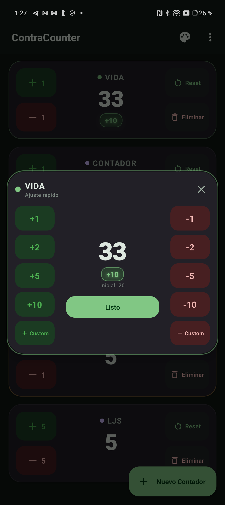
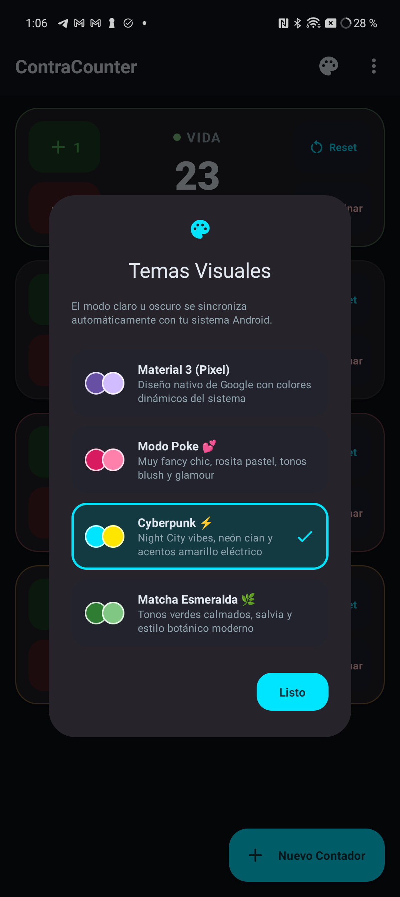

# ContraCounter 🔢⚡

> Aplicación de contadores para Android diseñada en **Material Design 3 (Material You)** nativo, ultra reactiva, ergonómica y optimizada especialmente para dispositivos **Google Pixel** y Android moderno.

---

## 🚀 ¿Por qué ContraCounter?

La mayoría de aplicaciones de contadores presentan interfaces anticuadas y carecen de retroalimentación inmediata, haciendo difícil verificar con certeza cuánto se ha sumado o restado durante partidas rápidas de cartas, juegos de mesa o actividades deportivas.

**ContraCounter** reinventa la experiencia desde los cimientos en **Jetpack Compose + Material Design 3**:
- 🎨 **Estilo Nativo de Google:** Barra superior minimalista con el título *ContraCounter* alineado a la izquierda sin elementos superfluos, siguiendo la línea de diseño de las aplicaciones de Google Pixel.
- 🌓 **Adaptación Automática al Sistema:** Integración completa con el tema claro u oscuro del dispositivo sin necesidad de configuraciones manuales.
- 🎭 **Selector de Temas Internos (Modal M3):** Pulsando el icono de la paleta en la barra superior se despliega un selector de paletas visuales:
  - **Material 3 (Pixel):** Dynamic Colors de Monet adaptados al fondo de pantalla de tu dispositivo.
  - **Modo Poke 💕:** Estilo *fancy chic* con tonos rosita pastel, blush y rose gold.
  - **Cyberpunk ⚡:** Inspirado en Night City con acentos neón cian y amarillo eléctrico.
  - **Matcha Esmeralda 🌿:** Tonos verdes botánicos y salvia relajantes.
- 👻 **Shadow Delta Tracker (5s / 3s):** Al interactuar de forma rápida y repetida sobre `+` o `-`, un distintivo flotante con brillo sutil acumula el balance neto modificado en los últimos 5 segundos, permaneciendo visible durante 3 segundos tras la última pulsación para ofrecer una confirmación visual clara.
- 🎯 **Ajuste Directo por Pulsación Prolongada:** Mantén pulsado el centro de cualquier contador para abrir el diálogo modal M3 y escribir directamente la cifra deseada o utilizar los chips rápidos (`+10`, `+5`, `-5`, `-10`, restaurar al valor inicial).
- 🛡️ **Reset y Borrado Protegidos con Confirmación:** Diálogos Material 3 para evitar reinicios o eliminaciones accidentales.
- ➕ **Nuevo Contador con Opción de Paso 1 en 1:** Selector para fijar el paso siempre de 1 en 1 (activado por defecto) o definir un paso personalizado, cantidad inicial, plantillas predefinidas (Vida MTG 20/40, Rondas, etc.) y selector de paletas de color.
- 🚀 **Mini Modal de Ajuste Rápido (+/- 1, 2, 5, 10 y Custom):** Mantén pulsado el botón de sumar (`+`) o restar (`-`) de cualquier contador para abrir el panel de control rápido:
  - **Columna izquierda:** Botones de acceso rápido para sumar `+1`, `+2`, `+5`, `+10` y `+ Custom`.
  - **Columna central:** Contador ampliado con odómetro animado elástico, shadow delta acumulado en tiempo real y botón de confirmación.
  - **Columna derecha:** Botones de acceso rápido para restar `-1`, `-2`, `-5`, `-10` y `- Custom`.
  - **Diálogo Personalizado:** Permite introducir cualquier valor a medida o elegir valores frecuentes (+5, +15, +20, +25, +50, +100).
- 📺 **Modo Pantalla Completa Inmersivo:** Toca una vez sobre cualquier contador para abrir su pantalla completa dedicada:
  - **Número Colosal:** Cifra en gran formato (hasta 104sp) con animación vertical fluida.
  - **Botones Hero Gigantes (`+ 1` y `- 1`):** Diseñados ergonómicamente en la zona inferior (105dp de altura) para un accionamiento cómodo y sin distracciones.
  - **Filas de Ajuste Rápido:** Acceso inmediato a incrementos y decrementos habituales (`+/- 2, 5, 10, Custom`).
  - **Mantener Pantalla Encendida (Keep Screen On):** Conmutador en la barra superior para evitar que la pantalla entre en suspensión durante sesiones de juego o eventos.
  - **Acciones Directas:** Edición directa de cifra, reseteo a valor inicial y navegación fluida con el botón atrás nativo de Android.
  - ✨ **Transición Nativa del Sistema (Activity & Predictive Back):** Apertura y retorno gestionados directamente por el sistema operativo Android, garantizando máxima fluidez y compatibilidad total con los gestos predictivos de Android 14/15 en dispositivos Pixel.
- 💾 **Persistencia Instantánea:** Todos los contadores, estados, pasos y temas se guardan localmente para continuar siempre donde se dejó.
- 📳 **Haptic Feedback:** Respuesta háptica táctil en interacciones clave y pulsaciones prolongadas.
- 👾 **Comprobador de Actualizaciones de GitHub:** Mantén pulsado el título *ContraCounter* en la barra superior para abrir el diálogo informativo con el logo oficial de **ContratopDev**, versión instalada y comprobación en tiempo real de nuevas releases publicadas en GitHub con enlace directo para su descarga.

---

## 📸 Capturas de Pantalla

| Vista Principal (Modo Poke 💕) | Pantalla Completa Hero (+1 / -1) | Shadow Delta Tracker (+3) | Ajuste Rápido Modal | Selector de Temas M3 |
| :---: | :---: | :---: | :---: | :---: |
|  |  |  |  |  |

---

## 🛠️ Tecnologías y Arquitectura

- **Lenguaje:** Kotlin 1.9+
- **UI Framework:** Jetpack Compose (BOM 2023.10.01 / M3)
- **Design System:** Material Design 3 con `dynamicLightColorScheme` y `dynamicDarkColorScheme`
- **Gestión de Estado:** Android ViewModel + Kotlin Coroutines + `StateFlow`
- **Persistencia:** SharedPreferences + Gson
- **Target SDK:** Android 34 (soporta desde Android 8.0 Oreo - API 26 hasta Android 15/16)

---

## 📁 Estructura del Código

```text
ContraCounter/
├── app/
│   ├── src/main/
│   │   ├── AndroidManifest.xml
│   │   ├── java/dev/contratop/contracounter/
│   │   │   ├── MainActivity.kt
│   │   │   ├── data/
│   │   │   │   ├── Counter.kt
│   │   │   │   └── CounterRepository.kt
│   │   │   └── ui/
│   │   │       ├── ContraCounterApp.kt
│   │   │       ├── CounterViewModel.kt
│   │   │       ├── FullscreenCounterScreen.kt
│   │   │       ├── theme/
│   │   │       │   ├── Color.kt
│   │   │       │   ├── Theme.kt
│   │   │       │   └── Type.kt
│   │   │       └── components/
│   │   │           ├── CounterCard.kt
│   │   │           ├── ShadowDeltaBadge.kt
│   │   │           ├── AddCounterDialog.kt
│   │   │           ├── SetDirectValueDialog.kt
│   │   │           ├── ResetConfirmDialog.kt
│   │   │           ├── DeleteConfirmDialog.kt
│   │   │           ├── ThemeSelectorDialog.kt
│   │   │           ├── AboutDialog.kt
│   │   │           └── QuickAdjustModal.kt
│   │   └── res/
│   │       ├── drawable/
│   │       │   ├── app_icon.xml
│   │       │   └── contratop_logo.png
│   │       └── values/
├── build.gradle.kts
├── settings.gradle.kts
└── gradle.properties
```

---

## 📦 Compilación y Generación del APK

El proyecto utiliza el wrapper de Gradle con JDK 17 configurado en `gradle.properties`.

### 1. Compilar APK Debug (Listo para instalar directamente)
```bash
./gradlew assembleDebug
```
El APK generado se encuentra en:
`app/build/outputs/apk/debug/app-debug.apk`

### 2. Instalar en tu Pixel o dispositivo conectado por USB/ADB
```bash
adb install -r app/build/outputs/apk/debug/app-debug.apk
```

### 3. Compilar APK Release
```bash
./gradlew assembleRelease
```
El APK se genera en:
`app/build/outputs/apk/release/app-release.apk`

---

## 👥 Desarrollado por
Desarrollado por **ContratopDev**.
